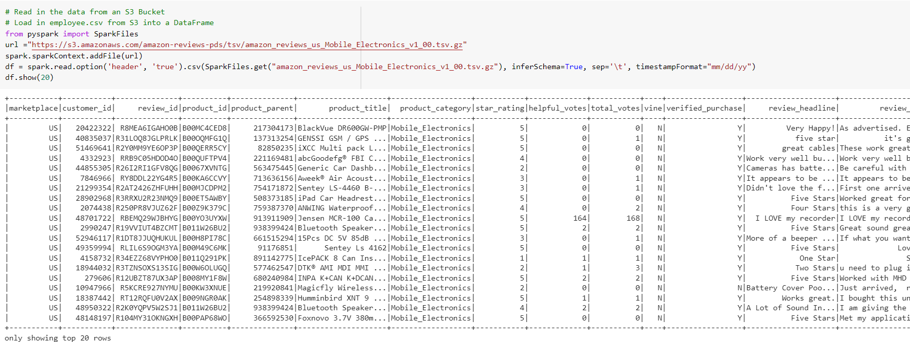
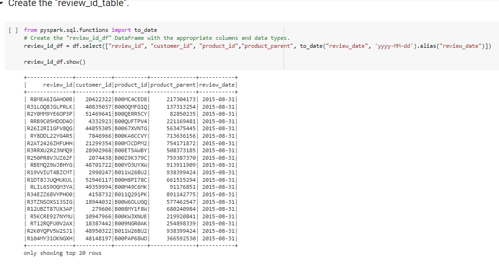
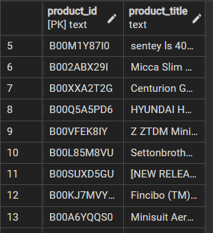

# Big-Data-ETL

### Background

Many of Amazon's shoppers depend on product reviews to make a purchase. Amazon makes these datasets publicly available. They are quite large and can exceed the capacity of local machines. One dataset alone contains over 1.5 million rows; with over 40 datasets, data analysis can be very demanding on the average local computer. Your first goal will be to perform the ETL process completely in the cloud and upload a DataFrame to an RDS instance.

### Objectives:

Put ETL skills to test.

### Part1:

1. Dataset:

https://s3.amazonaws.com/amazon-reviews-pds/tsv/amazon_reviews_us_Mobile_Electronics_v1_00.tsv.gz
https://s3.amazonaws.com/amazon-reviews-pds/tsv/amazon_reviews_us_Tools_v1_00.tsv.gz

2. Extract the Data

   1. Read in each dataset using the correct header and sep parameters.
      

   1. Get the number of rows in each dataset.

3. Transform the Data

For each dataset use the schema.sql file to create 4 dataframes according to the schema data type. For instance, we need to change review_date column to "date" type.

4.  Load the Data into an RDS Instance

Export each DataFrame into the RDS instance to create four tables for each dataset.
Here is one of the tables we created in PG Admin

